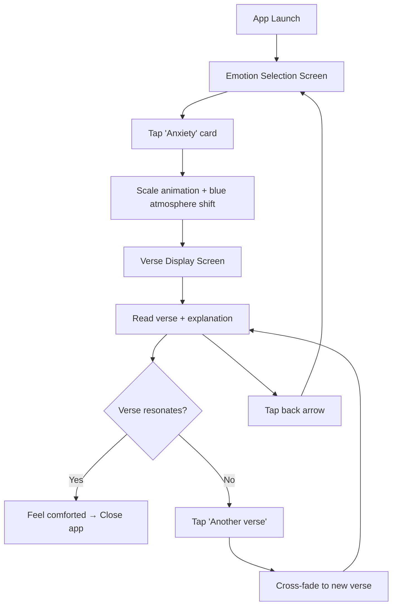
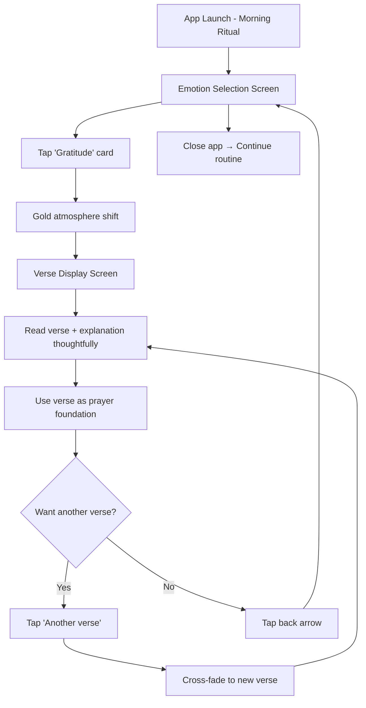
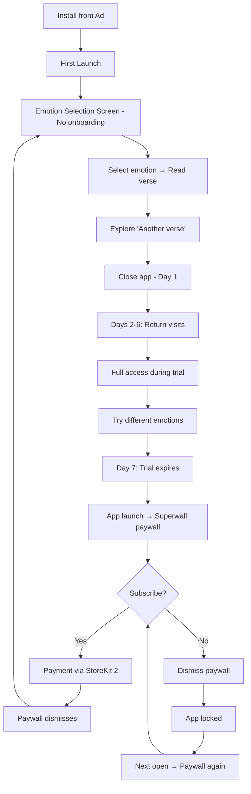
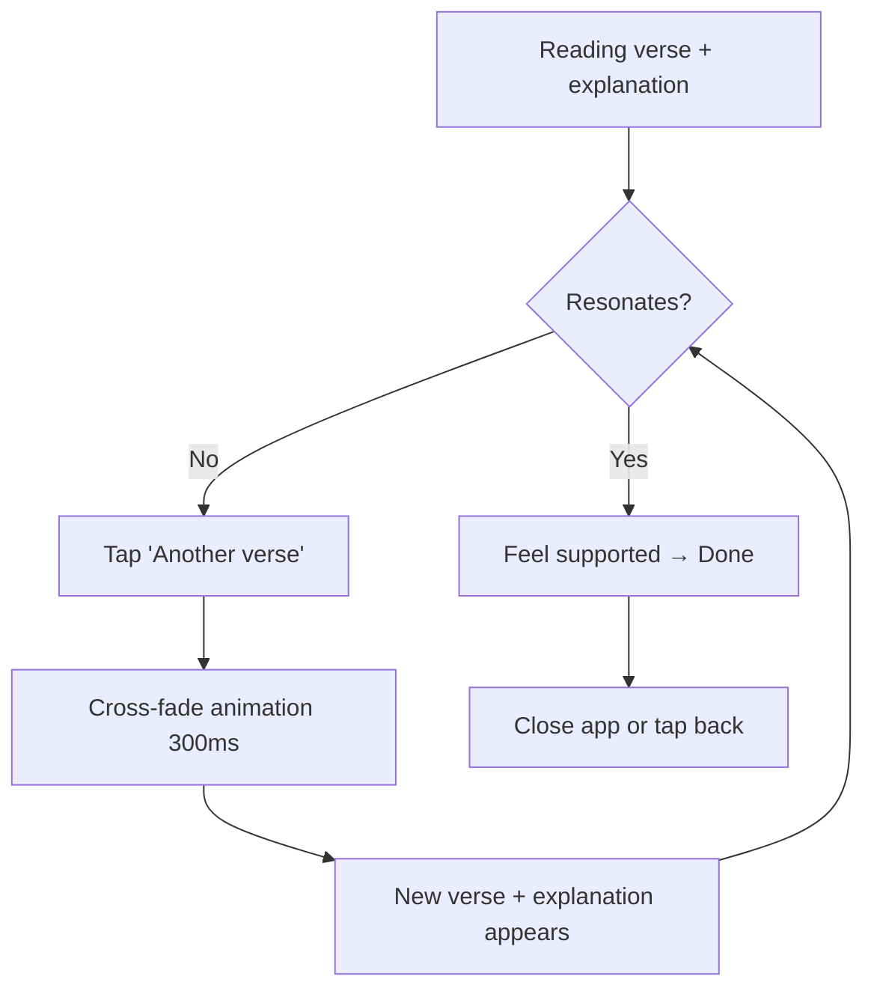

# UX Design Specification Faith Jar

**Author:** Oleg
**Date:** 2026-02-28

## Executive Summary

### Project Vision

Faith Jar delivers instant spiritual comfort by connecting emotions to curated Bible verses with explanations. The UX must achieve one thing exceptionally: get users from "I feel [emotion]" to "this verse speaks to me" in under 30 seconds, with zero friction. The design language should convey warmth, spiritual calm, and premium quality — positioning Faith Jar as the beautiful, simple alternative to cluttered competitors.

### Target Users

- **Comfort seekers (Maria):** Use the app reactively during emotional moments — anxiety at night, stress before meetings, sadness after bad news. Need: instant access, no cognitive load, verse that feels personally relevant.
- **Ritual builders (Grace):** Use the app proactively as part of daily spiritual practice — morning devotions, gratitude prayers. Need: fresh content each session, quick sessions (under 2 minutes), shareable moments.
- **Curious newcomers (Alex):** Discover via ads, evaluate during 7-day trial. Need: immediate value without setup, clear understanding of what they're paying for, compelling enough experience to convert.

### Key Design Challenges

1. **Paywall conversion UX** — trial countdown, value communication, and paywall screen must feel respectful and aligned with the spiritual tone, not aggressive or salesy
2. **Text-heavy core experience** — verse + explanation are both text blocks; layout must create visual hierarchy, breathing room, and emotional impact without overwhelming
3. **6-emotion selection** — must feel warm and inviting, not clinical; each emotion needs clear visual identity while maintaining cohesive design language

### Design Opportunities

1. **Premium minimalism** — competitors are cluttered; clean design with intentional whitespace and beautiful typography is a competitive differentiator
2. **Emotion-driven visual identity** — subtle color shifts per emotion category create personalized feel without code complexity
3. **Seamless verse transitions** — "another verse" interaction can feel meditative and calming rather than mechanical

## Core User Experience

### Defining Experience

**Core loop:** Select emotion → Read verse + explanation → Optional "another verse" → Done.

This is a **3-screen app:**

1. **Emotion Selection Screen** — main screen, 6 emotion buttons, app identity
2. **Verse Display Screen** — verse text, explanation, "another verse" button, back to emotions
3. **Paywall Screen** — managed by Superwall, shown on trial expiry

The entire user session lasts 30-60 seconds. The app opens, the user taps an emotion, reads a verse, and closes the app feeling better. There is no navigation menu, no tabs, no settings, no profile — just two functional screens and a paywall.

### Platform Strategy

- **Platform:** iOS (primary), React Native for future Android expansion
- **Input:** Touch-based, one-thumb operation (critical for "in bed at 11 PM" use case)
- **Offline:** Full functionality without internet — verse database bundled locally
- **Orientation:** Portrait only
- **No onboarding flow** — user lands directly on emotion selection

### Effortless Interactions

| Interaction | Must feel like... |
|---|---|
| Opening the app | Immediate — emotion screen appears instantly, no splash delay |
| Selecting an emotion | One tap — large, obvious touch targets |
| Reading verse + explanation | Calm, focused — no distractions, no other UI competing for attention |
| Tapping "another verse" | Seamless — new verse appears without page reload or jarring transition |
| Returning to emotions | One tap back — simple, obvious |

### Critical Success Moments

1. **First verse read (onboarding)** — if the first verse + explanation doesn't land, user may never return. Content quality + visual presentation must both deliver.
2. **"Another verse" discovery** — user realizes they can keep drawing. This is the moment the app surpasses the physical jar.
3. **Paywall decision (day 6-7)** — user must feel they've received enough value to justify $4.99/mo. The 7-day trial experience must build habit.
4. **Verse resonance** — the moment a specific verse + explanation perfectly matches the user's situation. This is the "aha moment" that drives retention.

### Experience Principles

1. **Calm over clever** — no animations for the sake of animations, no gamification, no badges. The app should feel like a quiet room, not a carnival.
2. **Content is the hero** — UI exists to serve the verse and explanation. Every design decision should make the text more readable, more impactful, more present.
3. **One-thumb, one-minute** — every interaction reachable with one thumb, every session completable in under a minute. Zero cognitive load.
4. **Spiritual, not religious UI** — warm, inviting, modern. Not churchy clip-art. Not sterile minimalism. Something in between — peaceful and premium.

## Design System Foundation

### Design System Choice

**Approach:** Custom minimal design system — no UI framework libraries. 3 screens, ~5 unique components. All styles custom for full control over premium spiritual aesthetic.

**Rationale:**
- 3 screens — UI library overkill, adds dependencies and limits visual control
- Premium spiritual feel requires full pixel-level control
- Spiritual aesthetic doesn't fit into Material/Cupertino frameworks
- Custom styles for 5 components — faster than configuring and overriding a library

### Color Palette

**Base palette — warm, spiritual, premium (light theme):**

| Role | Color | Usage |
|---|---|---|
| Background | Warm off-white / soft cream (#faf7f2 or similar) | Main app background — warm, inviting, spacious |
| Surface | White with warm undertone (#ffffff or #fefcf9) | Verse display card area |
| Primary text | Deep warm charcoal (#2d2a26) | Verse text, headings |
| Secondary text | Warm muted brown, italic (#8a7e72) | Explanations — visually "quieter" than verse |
| Accent | Soft gold (#c4956a) | Buttons, highlights, "another verse" |
| Subtle dividers | Light warm gray (#e8e2da) | Visual separation without harshness |

**Emotion-specific accent colors (subtle background or accent shifts):**

| Emotion | Color direction | Mood |
|---|---|---|
| Anxiety | Soft sky blue (#a8cce0) | Calming, cooling |
| Sadness | Gentle lavender (#b8a4c8) | Comforting, soft |
| Joy | Warm amber (#e8b86d) | Bright, warm |
| Loneliness | Soft teal (#8dc0ad) | Connected, grounding |
| Anger | Muted rose (#d4a0a0) | Soothing, not aggressive |
| Gratitude | Soft gold (#c4956a) | Rich, thankful |

**How emotion colors are used:** When user selects an emotion, a subtle gradient or tinted overlay shifts the screen atmosphere. Not a full theme swap — just enough to feel personalized per emotion.

**Note to designer:** A dark theme variant (deep navy #1a1a2e + cream text) can be explored as a future option or user preference. Light theme is the primary direction for MVP — aligns with spiritual/meditation app conventions (Calm, Abide, Pray.com).

### Typography

| Role | Style | Usage |
|---|---|---|
| Verse text | Serif font (Lora or Merriweather) — 20-24pt, regular weight | Bible verse — the hero content. Serif conveys gravitas and tradition. Mobile-optimized, lighter than Playfair Display. |
| Explanation text | Sans-serif (Inter or SF Pro) — 16pt, *italic or muted color* | Verse explanation — visually "quieter" than the verse. Feels like a wise friend whispering context, not a textbook. |
| Emotion labels | Sans-serif, medium weight — 16-18pt | Emotion button/card labels |
| App title / logo | Serif or custom — 28pt+ | App identity on emotion screen |
| UI elements | Sans-serif — 14pt | "Another verse" button, back button, subtle UI |

**Typography principle:** Serif for God's word, sans-serif for everything else. Explanation text is deliberately muted (italic + lighter color) to create sacred hierarchy: verse speaks first, explanation follows as a gentle companion.

### Animations & Micro-interactions

**MVP animations (subtle, calming):**

| Animation | Description | Purpose |
|---|---|---|
| **Emotion tap** | Soft scale-up (1.0 → 1.05) with gentle accent color transition into background | Confirms selection, introduces emotion atmosphere |
| **Verse appearance** | Fade-in from bottom (200-300ms, ease-out) | Verse feels like it's being "revealed", not loaded |
| **Explanation reveal** | Slight delay after verse (100ms), then fade-in | Creates reading rhythm: verse first, then explanation |
| **"Another verse"** | Current verse fades out, new verse cross-fades in (300ms) | Feels like turning a page, not clicking a button |
| **Back to emotions** | Reverse of entry — verse fades, emotions appear | Smooth, calm transition |

**Deferred to MVP+ (battery/complexity):** Breathing glow on emotion buttons, particle effects, ambient animations.

**Animation principles:**
- All transitions 200-400ms — fast enough to feel responsive, slow enough to feel calm
- Ease-out curves only — nothing bouncy or springy
- Implemented via `react-native-reanimated` for native performance
- Animations should feel like breathing, not fireworks

### Emotion Selection Layout

**Layout: Vertical card list (not grid)**

Each emotion is a full-width card/row with:
- Emotion icon or color indicator on the left
- Emotion label in the center
- Subtle accent color per emotion
- Generous vertical spacing between cards

**Rationale:** Vertical list gives each emotion more breathing room and feels more intimate than a utilitarian grid. Each emotion gets its own "moment" as the user scrolls or scans. Also better for one-thumb operation — easier to tap than small grid cells.

**Note to designer:** Cards should feel tappable and warm — rounded corners, subtle shadow or border, generous padding. Not flat buttons — elevated, inviting elements.

### Spacing & Layout

| Element | Specification |
|---|---|
| Screen padding | 24px horizontal, generous |
| Between verse and explanation | 24px — clear visual separation |
| Emotion card height | Minimum 64-72px — large, comfortable touch targets |
| Emotion card gap | 12-16px vertical spacing |
| Verse text area | Vertically centered on screen with generous whitespace above and below |
| "Another verse" button | Bottom of verse screen, 48px height, pill shape, centered |
| Back navigation | Top-left, subtle, doesn't compete with content |

**Layout principle:** Whitespace is a feature, not wasted space. Every screen should feel spacious and breathable.

### App Store Screenshot Considerations

**Visual elements that make great screenshots:**
- Warm light background with elegant serif verse text creates a premium, distinctive look
- Emotion accent colors create visual variety across screenshot gallery
- Each screenshot can feature a different emotion with its color shift
- Generous whitespace and typography signal quality and intentionality
- Dark variant screenshots can be mixed in for contrast in the App Store gallery

## User Journey Flows

### Journey 1: Comfort Seeking (Maria — Anxiety at 11 PM)

**Entry point:** App icon tap
**Goal:** Find a Bible verse that speaks to current anxiety
**Expected duration:** 20-30 seconds

**Flow:**

1. Maria taps the app icon → Emotion Selection Screen appears instantly (< 2 seconds cold launch)
2. She scans the vertical card list → taps "Anxiety" card
3. Anxiety card does a soft scale-up (1.0 → 1.05), background shifts to soft sky blue (#a8cce0) atmosphere
4. Verse Display Screen fades in from bottom (200-300ms):
   - Verse text appears first (serif, Lora, 20-24pt)
   - Explanation fades in with 100ms delay (sans-serif, italic, muted brown)
   - "Another verse" pill button visible at bottom
   - Back arrow (top-left, subtle)
5. Maria reads verse + explanation → feels comforted → closes app
6. **Alternative path:** Verse doesn't resonate → taps "Another verse" → current verse cross-fades to new verse (300ms) → reads again

### Journey 2: Daily Ritual (Grace — Morning Gratitude)

**Entry point:** App icon tap (habitual, daily)
**Goal:** Draw a gratitude verse for morning prayer foundation
**Expected duration:** 30-60 seconds

**Flow:**

1. Grace opens app → Emotion Selection Screen
2. Taps "Gratitude" card → soft gold (#c4956a) atmosphere shift
3. Verse Display Screen appears with gratitude verse + explanation
4. Grace reads verse slowly, uses it as prayer topic
5. Taps "Another verse" to get a second verse for evening prayer
6. Reads second verse → taps back arrow → returns to Emotion Selection
7. Closes app, continues morning routine

### Journey 3: New User + Paywall (Alex — Discovery to Conversion)

**Entry point:** App Store install from ad → first app launch
**Goal:** Experience value during trial → make subscription decision
**Expected duration:** 7-day journey

**Flow — First Session:**

1. Alex installs from ad → opens app for the first time
2. No onboarding, no account creation → lands directly on Emotion Selection Screen
3. Taps "Anxiety" → verse + explanation appears
4. Reads, taps "Another verse" → second verse appears
5. Closes app impressed

**Flow — Days 2-6 (Trial Period):**

6. Returns multiple times, tries different emotions
7. App works normally — full access, no interruptions
8. Trial countdown managed silently by Superwall (no intrusive banners during trial)

**Flow — Day 7 (Paywall Trigger):**

9. Alex opens app → Superwall detects trial expiry
10. Paywall Screen appears (managed by Superwall):
    - Clear value proposition
    - Pricing displayed ($4.99/mo or $29.99/yr)
    - Trial duration shown ("Your 7-day trial has ended")
    - Respectful, spiritual tone aligned with app design
11. **Convert path:** Alex subscribes → paywall dismisses → Emotion Selection Screen → full access restored
12. **Churn path:** Alex dismisses paywall → app locks → paywall reappears on next interaction

### Journey 4: Verse Doesn't Resonate (Recovery Flow)

**Entry point:** Already on Verse Display Screen
**Goal:** Find a verse that truly connects
**Expected duration:** 10-20 seconds additional

**Flow:**

1. User reads verse + explanation → doesn't connect emotionally
2. "Another verse" button is clearly visible at the bottom — no hunting
3. User taps "Another verse" → current verse cross-fades out, new verse cross-fades in (300ms)
4. No page reload, no navigation change — same screen, same atmosphere
5. User reads new verse → resonates → done
6. **Extended path:** User taps "Another verse" 2-3 more times → each tap is instant, no dead-ends, verses don't repeat within session

**Key UX principle:** The "miss" is handled gracefully. No frustration signals (no "try again" messaging, no error states). The cross-fade animation makes each new verse feel like gently turning a page, not failing and retrying.

### Journey Patterns

**Navigation Patterns:**
- **Forward:** Emotion Selection → Verse Display (always one tap)
- **Backward:** Verse Display → Emotion Selection (back arrow, top-left)
- **Lateral:** Verse → Another Verse (same screen, cross-fade, no navigation change)
- **Interrupt:** Any screen → Paywall (Superwall-managed, only on trial expiry)

**Decision Patterns:**
- **Binary emotion choice:** User scans 6 options, taps one. No multi-select, no hierarchy, no sub-categories.
- **Continue or done:** After reading a verse, user either taps "Another verse" or leaves. Two clear options, zero cognitive load.
- **Subscribe or not:** Paywall presents clear choice. No manipulation, no dark patterns — respectful UX aligned with spiritual tone.

**Feedback Patterns:**
- **Selection confirmation:** Emotion card scale-up + atmosphere color shift = "I heard your tap"
- **Content arrival:** Verse fade-in from bottom + staggered explanation = "Here's your verse, read at your pace"
- **Verse change:** Cross-fade transition = "New verse, same calm space"
- **No loading states:** All data is local — no spinners, no skeleton screens, no "loading..." text

### Flow Optimization Principles

1. **Zero dead-ends:** Every screen has a clear next action. Verse Display always offers "Another verse" + back. Emotion Selection always offers 6 tappable cards. Paywall always offers subscribe + dismiss.
2. **No confirmation dialogs:** Tapping an emotion immediately shows a verse. Tapping "Another verse" immediately shows a new one. No "Are you sure?" — every action is instantly reversible.
3. **Atmosphere continuity:** When user selects an emotion, the color atmosphere persists across all verse views for that emotion. Switching emotions = switching atmosphere. This creates subtle visual "rooms" per emotion.
4. **Session memory:** Within a single session, verses don't repeat for the same emotion. Across sessions, repetition is acceptable (120 verses per emotion provides sufficient variety).
5. **Paywall as checkpoint, not interruption:** Superwall handles paywall timing. During the 7-day trial, the user never sees payment-related UI. The paywall appears only when the trial ends — one clean transition point, not persistent nagging.
